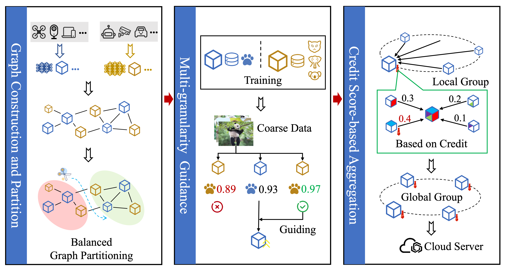

### ✨ Proposed Method

This paper introduces **MG²FL**, a multi-granularity grouping-based federated learning framework designed for green edge computing systems. To reduce communication overhead, the framework utilizes balanced graph partitioning to group edge devices that exhibit low communication energy consumption and latency. Within these groups, a multi-granularity guidance mechanism is employed, allowing fine-granularity models to guide models trained with lower granularity data, thereby enhancing overall model performance. Furthermore, MG2FL incorporates a dynamic credit model to evaluate edge devices; the device with the highest credit score is selected as the group leader for model aggregation, which significantly improves security and robustness against malicious behavior.

### 📊 Experimental Results

* **Accuracy Enhancement:** The MG2FL approach consistently improves model accuracy by 2.7% to 5.6% compared to traditional federated learning algorithms.

* **Robust Security:** In scenarios involving malicious edge devices, the method achieves a maximum accuracy improvement of 11.1% over baseline models.

* **Energy Efficiency:** Compared to other grouping methods with similar latency, MG2FL successfully reduces energy consumption by 12.64%.

* **Optimized Guidance:** The proposed graph partitioning strategy achieves a minimum improvement of 25% in guidance capability while ensuring similar computational capabilities across different groups.

### 🤝 Collaborating Institutions
Tianjin University; Guangming Laboratory of Artificial Intelligence and Digital Economy (SZ); Carleton University

  
  
  

