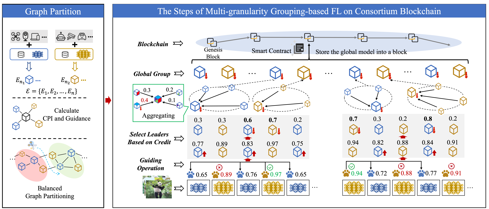

### ✨ Proposed Method
This paper proposes a **Graph-Partitioning Multi-Granularity Federated Learning (GP-MGFL)** method built on a consortium blockchain. To reduce overall communication overhead, the framework uses a balanced graph partitioning algorithm to group edge clients, which minimizes high-cost communications while ensuring effective intra-group guidance. Furthermore, the system introduces a cross-granularity guidance mechanism where fine-granularity models guide coarse-granularity models to fully leverage data heterogeneity and enhance accuracy. To maintain security, a dynamic credit model is implemented to adjust clients' contributions to the global model and automatically select group leaders for model aggregation.

### 📊 Experimental Results
* **Accuracy Enhancement:** The GP-MGFL algorithm achieves an accuracy that is 5.6% higher than that of ordinary blockchain-based federated learning (BFL) algorithms.
* **Superior Grouping:** Compared to other grouping methods, such as greedy grouping, the proposed GP-MGFL approach improves accuracy by approximately 1.5%.
* **Robust Security:** In scenarios involving malicious clients, the method demonstrates strong robustness, achieving a maximum accuracy improvement of 11.1% over baseline models.

### 🤝 Collaborating Institutions
Tianjin University; Guangming Laboratory of Artificial Intelligence and Digital Economy (SZ); Beijing University of Posts and Telecommunications; Nanyang Technological University

  
  
  
  

