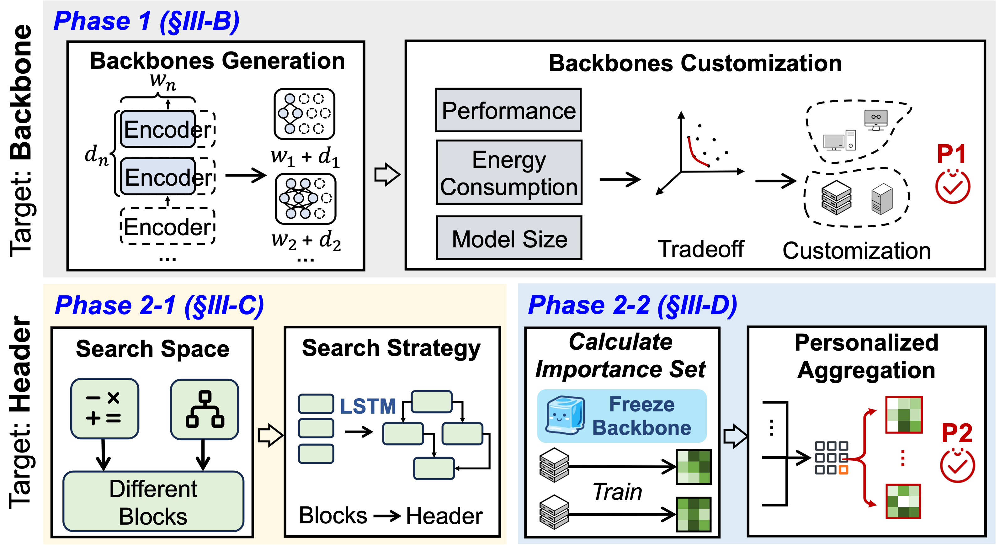

### ✨ Proposed Method
This paper proposes **ACME**, an adaptive customization approach of Transformer-based large models via distributed systems. To avoid the low cost-efficiency of centralized methods, ACME employs a bidirectional single-loop distributed system to progressively achieve fine-grained collaborative model customization. To better match user heterogeneity, it begins by customizing the backbone generation and identifying the Pareto Front under model size constraints to ensure optimal resource utilization. Subsequently, it performs header generation and refines the model using data distribution-based personalized architecture aggregation to match data heterogeneity.

### 📊 Experimental Results
* **Exceptional Efficiency:** Compared to centralized systems, ACME significantly reduces the data transmission volume to only 6%.
* **Accuracy Enhancement:** The proposed approach achieves an average accuracy improvement of 10% over the baseline models.
* **Optimal Trade-off:** ACME successfully generates cost-efficient models under strict model size constraints, increasing the overall trade-off metrics by nearly 30%.

### 🤝 Collaborating Institutions
Tianjin University

   

