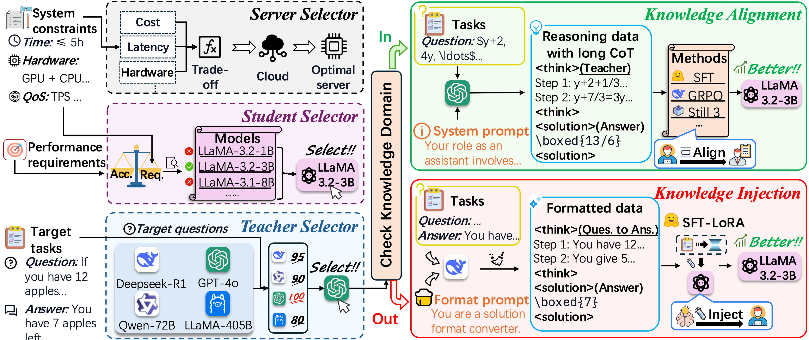
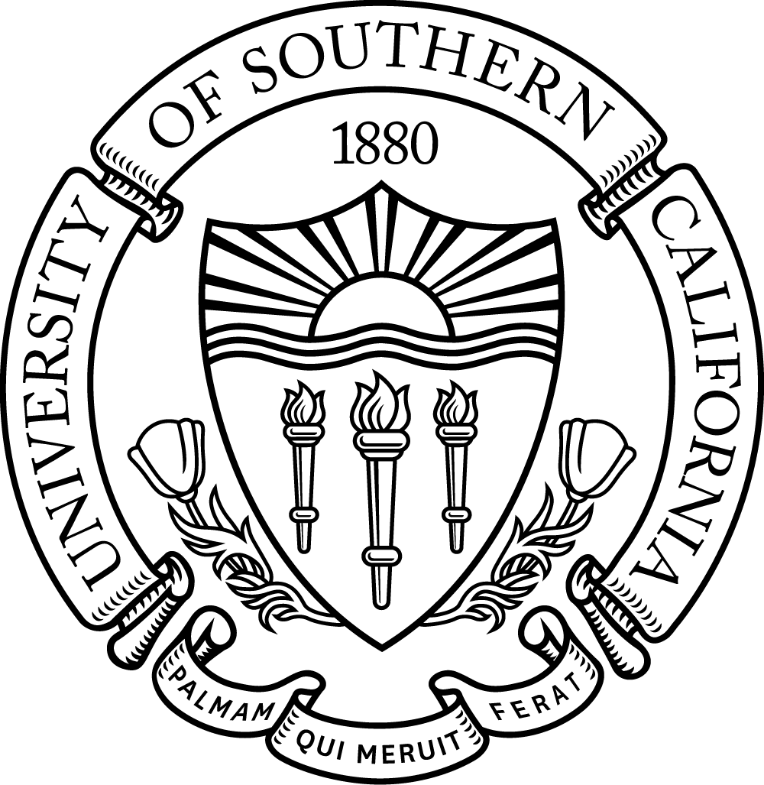
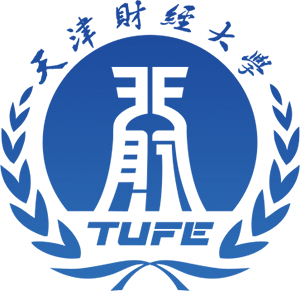

### ✨ Proposed Method
This paper introduces **Stratos**, an end-to-end Large Language Model (LLM) distillation pipeline designed to automate server/model selection, knowledge distillation, and deployment in distributed cloud environments. To optimize cloud hosting under user-defined budget and latency constraints, Stratos automatically selects Pareto-optimal servers and dynamically matches teacher-student model pairs. Furthermore, it features an adaptive dual-mode knowledge distillation framework that intelligently switches between "Knowledge Alignment" and "Knowledge Injection" based on the task's complexity and the teacher model's domain coverage.

### 📊 Experimental Results
* **Exceptional Domain Adaptation:** On a rare, domain-specific Mahjong reasoning task, the Stratos-distilled student model achieves four times (4x) the accuracy of its GPT-4o teacher baseline.
* **Optimal Resource Efficiency:** By successfully balancing accuracy, latency, training time, and cost, Stratos improves the overall deployment score by at least 22% compared to traditional single-objective (e.g., accuracy-first or cost-first) selection methods.
* **Strong Generalization:** The pipeline demonstrates significant reasoning enhancements and robust generalization capabilities across complex mathematical reasoning benchmarks, such as GSM8K and AIME.

### 🤝 Collaborating Institutions
Tianjin University; University of Southern California; Tianjin University of Finance and Economics; Paiou Cloud Computing (Shanghai) Co., Ltd

  
  
  
  

