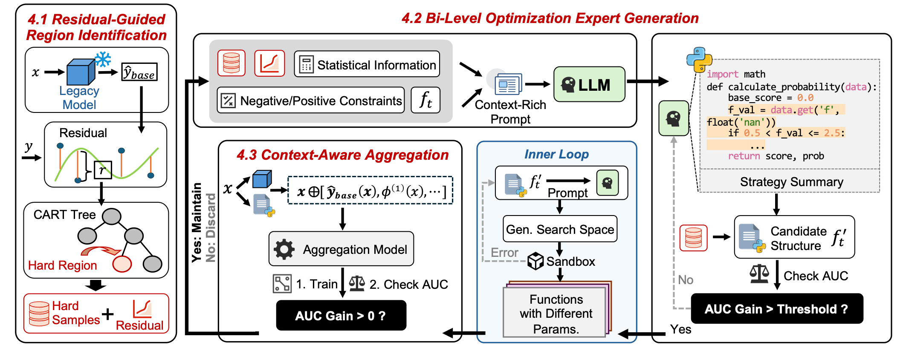
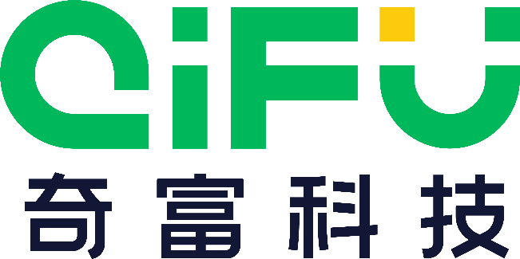

### ✨ Proposed Method
This paper introduces **NSR-Boost**, a neuro-symbolic residual boosting framework specifically designed to upgrade industrial legacy models in high-concurrency production environments without prohibitive retraining costs. The core advantage of NSR-Boost is its "non-intrusive" nature: it treats the legacy model as a frozen entity and performs targeted repairs exclusively on "hard regions" where predictions fail. The framework operates in three key stages: first, it locates hard regions through residual analysis; second, it generates interpretable experts using a bi-level approach (generating symbolic code structures via an LLM and fine-tuning parameters using Tree-structured Parzen Estimator optimization); finally, it dynamically integrates these experts with the legacy model's output using a lightweight aggregator.

### 📊 Experimental Results
* **Superior Performance:** Experimental results demonstrate that the NSR-Boost framework significantly outperforms state-of-the-art (SOTA) baselines.
* **Cost-Effective & Safe Upgrades:** It successfully avoids the systemic risks and prohibitive retraining costs typically associated with upgrading legacy models in production environments.
* **High Interpretability:** By utilizing an LLM to generate symbolic code structures (such as Python functions) as experts, the framework maintains crucial interpretability and provides actionable feedback constraints for industrial applications.

### 🤝 Collaborating Institutions

Tianjin University; Qfin Holdings, Inc.

  
  

