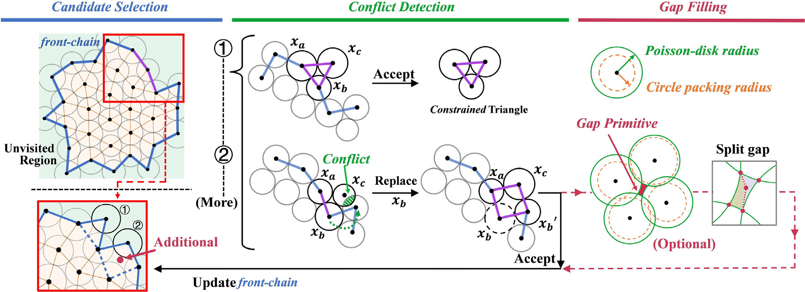

### ✨ Proposed Method
This paper proposes a **spatial covering model based on constrained cells** for Poisson-disk sampling. The model maintains both minimum distance and maximal coverage properties within local cells, then constructs the sample distribution in a single-pass manner. Guided by this geometric model, the method uses circle packing to generate high-quality blue-noise samples efficiently while allowing a controllable trade-off between noise and aliasing.

### 📊 Experimental Results
* **Single-Pass Efficiency:** The method avoids expensive gap tracking in many sampling scenarios and generates high-quality distributions with extreme efficiency.
* **Adaptive Sampling:** The framework extends to arbitrary density functions in linear time, making it suitable for practical adaptive sampling tasks.
* **Application Quality:** Experiments demonstrate competitive blue-noise properties and application results in image stippling and surface remeshing.

### 🤝 Collaborating Institutions
Tianjin University; Communication University of China

  

