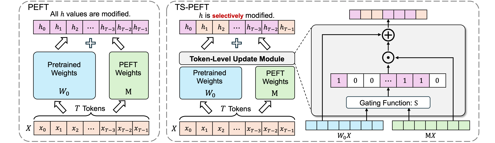

### ✨ Proposed Method
This paper introduces **TS-PEFT**, a theoretical framework utilizing proximal optimization that acts as a dynamic probe to identify token-level redundancy during the fine-tuning process of large models. Current Parameter-Efficient Fine-Tuning (PEFT) methods typically operate under the assumption that every token passing through a selected target module contributes equally and requires a parameter update. TS-PEFT challenges this convention by dynamically identifying and removing unnecessary token updates to optimize the adaptation mechanism.

### 📊 Experimental Results
* **Efficiency and Performance:** By discarding 30% to 70% of token updates, TS-PEFT consistently matches or exceeds the performance of dense baselines such as LoRA and DoRA.
* **Noise Reduction:** Extensive experiments demonstrate that indiscriminately updating all tokens is not only computationally superfluous but often introduces optimization noise.
* **Module Importance Indicator:** In-depth analysis shows that the learned token-level sparsity is a superior indicator of module importance compared to traditional weight criteria, providing a novel data-driven perspective on large models.

### 🤝 Collaborating Institutions

Tianjin University; Qfin Holdings, Inc.

  
  

